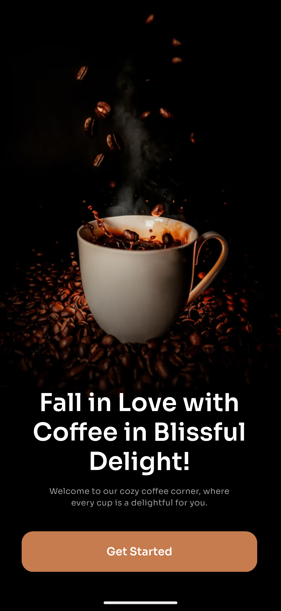
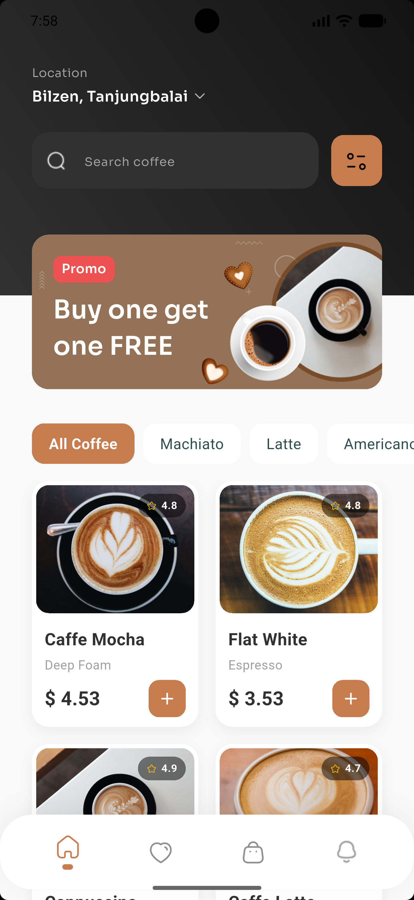
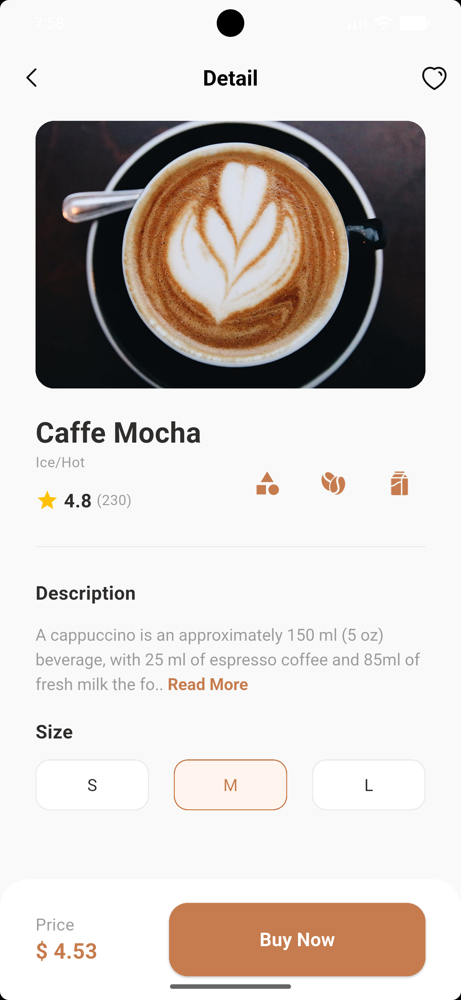
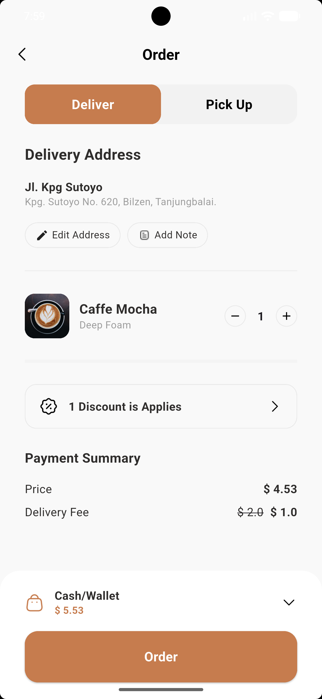
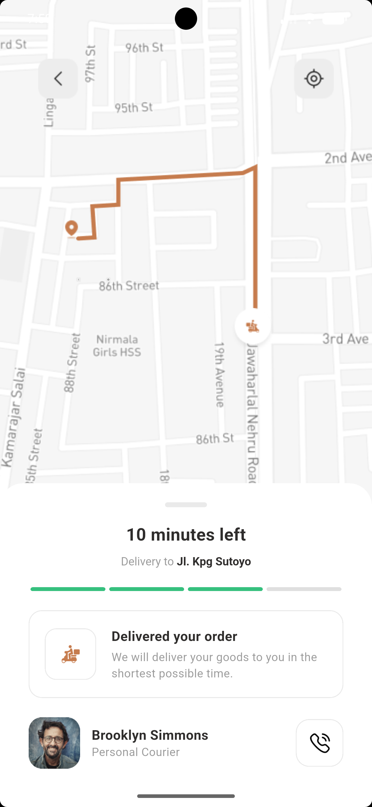

# ☕ Coffee Shop - High-Fidelity Flutter UI

A premium, responsive, and feature-rich Coffee Shop application built with Flutter. This project
demonstrates a complete user journey—from a stylish onboarding experience to a detailed delivery
tracking system—following modern UI/UX design patterns.

---

## 📱 Visual Preview

|           Welcome Screen            |         Home Catalog          |             Detail View             |
|:-----------------------------------:|:-----------------------------:|:-----------------------------------:|
|  |  |  |

|         Order Checkout          |           Delivery Tracking           |
|:-------------------------------:|:-------------------------------------:|
|  |  |

---

## ✨ Features

### 🏁 Onboarding & Navigation

- High-impact entry screen with clear call-to-action.
- Smooth navigation flow using standard Flutter routing.

### 🏠 Home Screen

- **Dynamic Categories**: Filter coffee types (All, Mocha, Latte, etc.).
- **Promo Banners**: Overlapping UI elements for a modern feel.
- **Responsive Grid**: Automatically adjusting coffee item cards using `flutter_screenutil`.

### ☕ Detail Screen

- **Interactive Selection**: Choose coffee sizes (Small, Medium, Large) with real-time UI updates.
- **Rich Content**: Detailed descriptions with an expandable "Read More" feature.
- **Visual Rating**: Integrated rating system display.

### 🛍️ Order & Checkout

- **Delivery Toggle**: Switch between "Deliver" and "Pick Up" modes.
- **Address Management**: Visual address display and editing interface.
- **Payment Summary**: Detailed breakdown of item prices, delivery fees, and discounts.

### 📍 Live Delivery Tracking

- **Visual Map Tracking**: Implemented using layered assets to simulate a real-time tracking
  experience.
- **Progress System**: A 4-step delivery status bar (Ordered, Picked Up, Near You, Delivered).
- **Courier Interaction**: Profile card with courier details and functional calling integration.

---

## 🛠️ Technical Stack

- **Framework**: [Flutter](https://flutter.dev/)
- **State Management**: Reactive UI using `StatefulWidget`.
- **Styling**:
    - **Typography**: [Sora](https://fonts.google.com/specimen/Sora) via Google Fonts.
    - **Responsiveness**: `flutter_screenutil` for scaling across device sizes (`.w`, `.h`, `.sp`,
      `.r`).
- **Layouts**: Extensive use of `Stack`, `Positioned`, and `Flex` for complex UI overlays.

---

## 📂 Project Structure

```text
lib/
├── CustomWidgets/
│   └── coffee_item_card.dart   # Reusable coffee catalog card
├── screens/
│   ├── home.dart               # Discovery & Category filtering
│   ├── detail_screen.dart      # Product details & size selection
│   ├── order_screen.dart       # Order summary & delivery options
│   └── delivery_screen.dart    # High-fidelity tracking UI
├── utils/
│   └── AppColors.dart          # Centralized theme color constants
└── main.dart                   # Application entry point
```

---

## 🚀 Getting Started

1. **Clone the repository**:
   ```bash
   git clone https://github.com/AmiraAbdel-fatah/Coffee-Shop-App.git
   ```
2. **Install dependencies**:
   ```bash
   flutter pub get
   ```
3. **Run the application**:
   ```bash
   flutter run
   ```

---

## 🎨 Credits

UI Design based on modern high-fidelity coffee ordering prototypes. Assets curated for a premium
e-commerce experience.

---

## 📄 License

This project is for portfolio and educational purposes.
